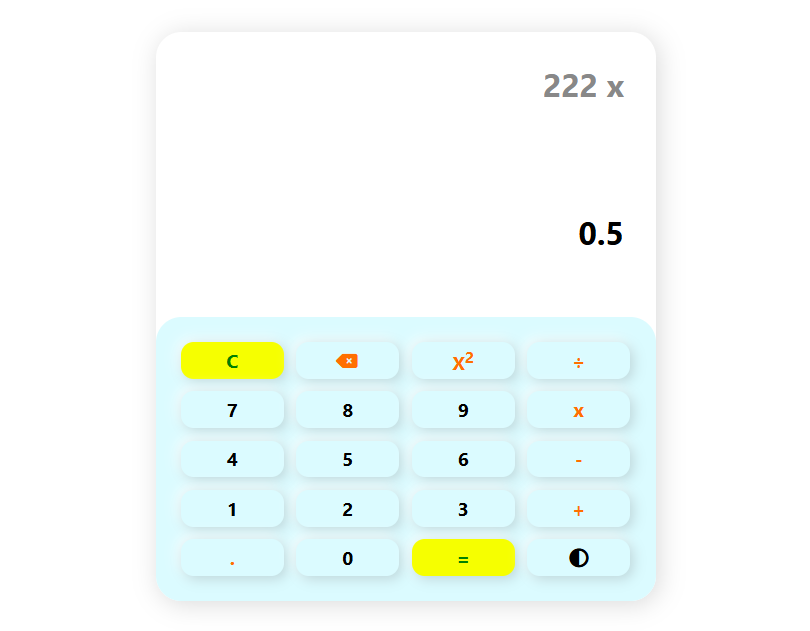
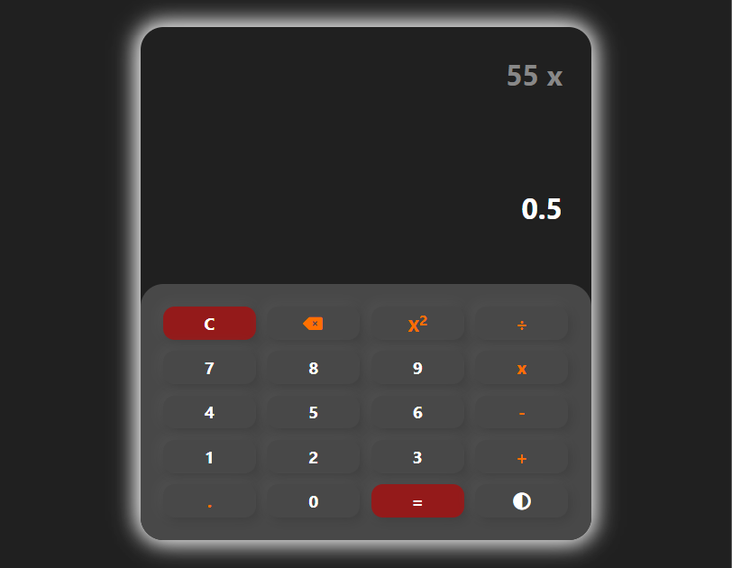

# Neumorphic Calculator Web App
A sleek **neumorphic-style calculator** with full **light/dark mode**, keyboard support, and advanced arithmetic functions. Perfect for desktops and mobile devices.

---

## Live Demo

Link: [Click here!](https://hameed-codes.github.io/Neumorphic-Calculator/)

---

## Screenshots




---

## Features
* **Neumorphic UI design** – soft shadows and realistic button effects
* **Basic arithmetic operations**: `+`, `-`, `×`, `÷`
* **Square function** – instantly calculate the square of a number
* **Keyboard support**:

  * Digits: `0-9`
  * Operators: `+`, `-`, `*`, `/`
  * `Enter` → equals
  * `Backspace` → delete last input
  * `Escape` → clear all
* **Responsive layout** – works seamlessly on mobile, tablet, and desktop
* **Light/Dark mode toggle** for personalized viewing
* **Smooth button press effects** mimicking real tactile buttons

---

## Design Style

* **Neumorphism (Soft UI)**: subtle shadows and highlights for a tactile feel
* **Dark & Light Mode**: switch seamlessly for day/night usage
* **Responsive**: all buttons scale and align correctly on any screen

---
## Technologies Used

* **HTML5** – semantic structure
* **CSS3** – neumorphic styling, responsive design, light/dark theme
* **JavaScript (ES6)** – calculation logic, keyboard support, theme toggle
* **Font Awesome** – modern icons

---

## How To Run Locally

1. Clone the repository:
```bash
git clone https://github.com/your-username/neumorphic-calculator.git
```
2. Navigate to the folder.
3. Open `index.html` in any browser.

## Author

[Hameed Khan](https://github.com/hameed-codes)
Computer Science Student
